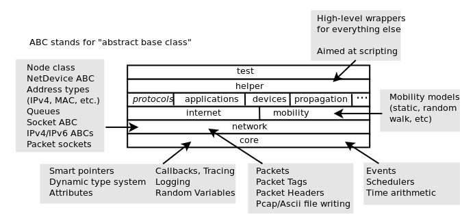
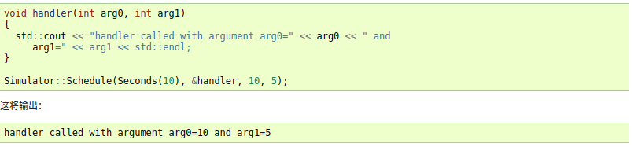

# ns3 study note  
## ns3 运行指令  
`./ns3 configure --build-profile=debug --enable-examples --enable-tests --enable-python-bindings`  
`./ns3 run '<ns3-program> --arg1=value1 --arg2=value2 ...'`  

## ns3 结构：  
  
ns3组织结构:  
如上图所示，对于所有的协议、硬件、和环境模型中都是通用的。
核心位于src/core文件夹中，数据包位于src/network中，这两个仿真模块构成一个通用的仿真核心，可以为不同的网络类型使用（不仅仅基于互联网的网络）。此两个模块与网络和设备无关。  
### 常见结构
#### Node节点

### 模拟器（simulator类）  
Simulator 类是访问事件调度工具的公共入口点。一旦安排了几个事件来启动模拟，用户就可以通过进入模拟器主循环（调用Simulator::Run）来开始执行它们。一旦主循环开始运行，它将按照从最旧到最近的顺序顺序执行所有计划的事件，直到事件队列中没有更多事件或已调用 Simulator::Stop。  
Simulator 类提供了 Simulator::Schedule* 系列函数，来安排事件由模拟由模拟器主循环执行。例如：  
  
安排事件有两种基本方法，有上下文和无上下文。  
如：
`Simulator::Schedule(Time const &time, MEM mem_ptr, OBJ obj);`  
以及：`Simulator::ScheduleWithContext(uint32_t context, Time const &time, MEM mem_ptr, OBJ obj);`  
其中，当前执行的网络节点的节点 ID 实际上是由 Simulator 类跟踪的。可以使用 Simulator::GetContext 方法访问它，该方法返回关联并存储在当前正在执行的事件中的“上下文”（32 位整数）。在极少数情况下，当事件与特定网络节点无关时，其“上下文”设置为 0xffffffff。  
为了将上下文关联到每个事件，Schedule 和 ScheduleNow 方法会自动重用当前正在执行的事件的上下文作为稍后计划执行的事件的上下文。
