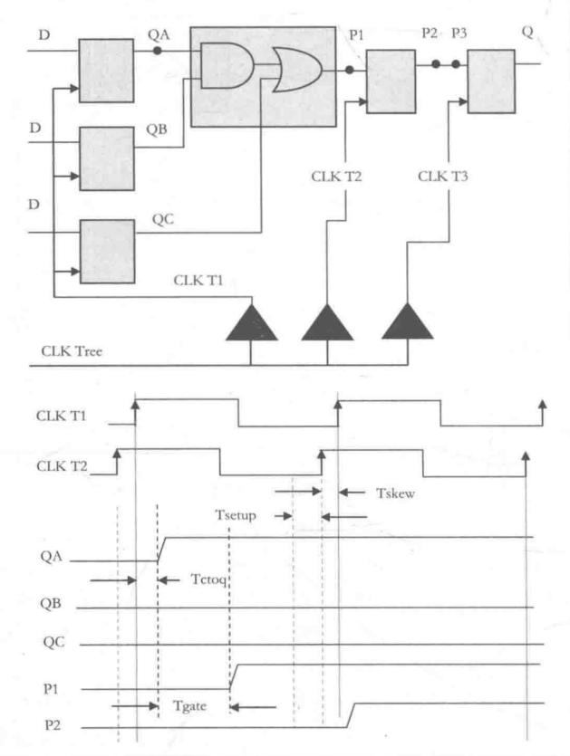

1. case可以在括号里使用常数，然后在每个选项里用变量。（此时要求后面的chose[]中只能有一个变量为1，不能存在两个及其以上的位为1）  
比如： 
```verilog
case(1'b1)
    chose[0]:
    //code
    chose[1]:
    //code
endcase
```
2. 综合后的电路主要有触发器和组合逻辑电路构成，其中触发器主要是D触发器
3. 在Verilog语言中可以使用两种方法描述组合逻辑：always块和assign语句。其中always块描述时变量被声明为reg类型，assign语句描述时，变量被声明为wire类型。
4. 在always块中，最开始可以写信号的默认值。这样做可以确保综合后不生成锁存器。
5. verilog语法包含求模（%）与指数运算（x**y）  
6. 局部参数一般用于状态机的状态命名，或者其他在本模块中不会发生变化的量。  
7. 参数在使用前需要被定义，参数可以在模块中定义，也可以使用`include在指定的头文件指出。（扩展名为.vh，此时参数名应该取的较长从而避免冲突）  
8. verilog中的function只能有一个输出，不过位宽可以随意指定。  
9. generate语句用于简化代码，或进行多次例化。参数用genvar表示。  
10. `ifdef语句只有某一个分支对应的代码会在网表中实际出现，而mux语句中所有分支都会出现在综合后的网表中。  
11. `$finish;`仿真器完成仿真并退出。`$stop;`仿真器停止仿真但不退出，在命令提示符后面输入.则继续进行
12. 建议将`$display`放在testbench中，通过xxx.xxx指明信号在DUT中的路径。（条件下`$dispaly`可以放在always@（posedge clk）语句中）
13. `$display`在执行该语句的当前数值显示在屏幕上，`$monitor`在监视的数值信号发生变化时才在屏幕上显示他的信号数值。
14. `$time`返回当前仿真器的仿真时间（整数），`$realtime`返回的仿真时间为实数
15. `$random`返回32位带符号的随机整数，将`$random`放在{}内可以得到非负整数，`$random（seed）`可以指出随机数的取值范围。
16. `$readmemh`和`$writememh`用于从文件中读取/写入数据。
17. 任务task可以定义自己的输入输出端口，并且可以在任务中定时控制（如@posedge clk、non-zero timings 和 #10等），任务是顺序执行的，有时任务也可以综合但是一般不可综合，用于testbench中。
18. 在实际应用中，一个芯片内的存储器通常是通过定制设计的SRAM来实现的，而不是通过综合生成的。
19. repeat用法：repeat（5） begin 代码 end
20. force和release可以将固定值赋予一个reg或wire，在release之前，无论怎样被驱动都不会改变。
21. fork/join语句内部是并发执行的。每个begin end中的代码串行执行，但是fork/join夹在中间的各个代码块之间并行执行。
22. 与门和或门实际没有与非门和或非门快，cmos工艺中通常使用后者。
23. 综合逻辑将复杂逻辑门当成一个基本单元看待，以减少芯片面积。
24. 复杂数字系统中的状态机通常是由D触发器构成的。
25. D触发器的RST#从0跳变为1的过程需要与时钟同步，即在某个时钟上升沿出现时，RST#发生翻转。而RST#可以在任何时间置为0，不需要与时钟同步。并且此时Q的值立刻改变，不需要下一个时钟上升沿出现时才改变。
26. 两个D触发器组成的同步器，可以一定程度上避免亚稳态。
27. 当信号从一个时钟域进入到另一个时钟域时，需遵循以下几条设计准则：- 跨时钟域的信号必须直接来自猿时钟域的寄存器输出。 - 使用逻辑单元库中的专用触发器实现两级同步器。（专用触发器具有高驱动能力和高增益。） - 在一个点而不是多个点上进行跨时钟域信号的同步。 
28. 通过时钟树综合工具可以有效的减少时钟偏移，但不能消除时钟偏移。  
29. 数字系统可以划分为两类，一种是时钟频率固定（如PCIe，SATA，USB等），此时设计目标是确保两个触发器之间的延迟不超过一个时钟周期；另一种（如处理器设计）是要尽可能的降低门延迟，最大限度地提高系统的时钟频率。
30. 当门和互连线的延迟之和超过了允许的Tgate(max)时，系统就会出现定时错误。
31. 另一种错误是源触发器的输出和目标触发器的输入之间之间逻辑门过少或者根本没有逻辑门的情况，导致的保持时间错误。 此外时钟偏移可能会加剧这种情况。（可能导致保持时间内信号变化，或者是漏采样的问题。）
32. 同步上升沿检测：打拍取反后相与；同步下降沿检测：打拍后与上源时钟取非；同步检测任意边就上升沿和下降沿取或。
33. （慢速时钟到快速时钟的）异步上升沿检测：打三拍，然后第二排与上第三排取反。这个就是打个几拍就好了，具体三四拍都有可能，具体几拍听设计组长的（笑）。
34. 累加器的一个加数恒定为1，与完整的加法器相比，累加器所需要的逻辑门数要小的多。
35. LFSR计数器工作速度更快、技术序列是随机的、只用最终值不会造成困难，但是使用中间值会造成应用上的困难、计数序列通常有2^n - 1种状态，但是可以被设计成具有2^n个状态的计数器，此时需要使用n+1个触发器，然后截短输出序列、LSFR可以使用XOR或者XNOR反馈，XOR反馈是全0为非法状态，XNOR时全1为非法状态、存在两种类型的LFSR（多到一、一到多），对于多到一类型的，多个触发器的输出进行异或运算，输出结果到一个寄存器；对于一到多类型的，一个触发器的输出到异或函数，计算结果驱动多个触发器、一到多类型的LFSR能够具有比多到一类型的有更快的工作速度，因为它需要的组合逻辑级数更少。
36. 扰码的作用：扰码可以使重复的数据图案的频谱被展宽，从而减低电磁干扰（EMI）。可以减少并行线路中的串扰，可以使功率谱分布更为平滑和均匀，从而降低高频串扰。
37. 
38. 
