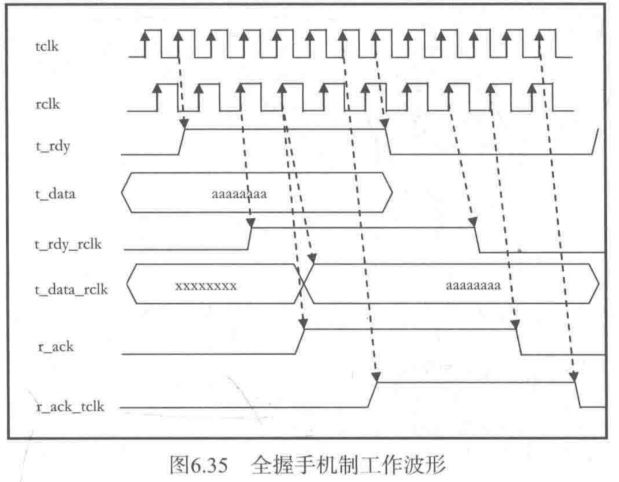
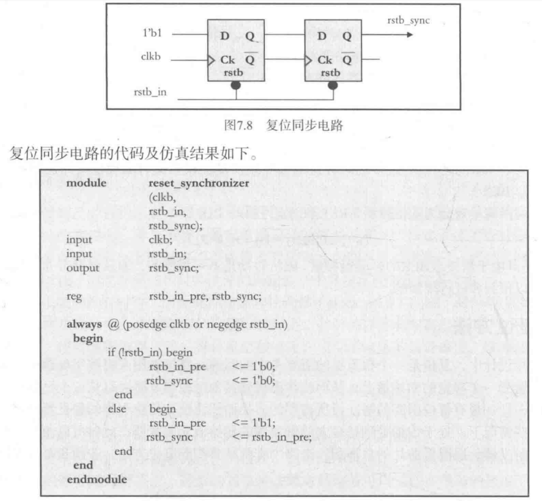
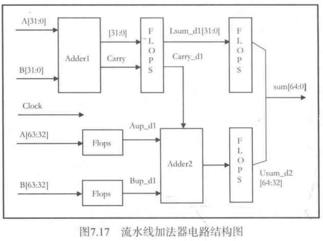

1. case可以在括号里使用常数，然后在每个选项里用变量。（此时要求后面的chose[]中只能有一个变量为1，不能存在两个及其以上的位为1）  
比如： 
```verilog
case(1'b1)
    chose[0]:
    //code
    chose[1]:
    //code
endcase
```
2. 综合后的电路主要有触发器和组合逻辑电路构成，其中触发器主要是D触发器
3. 在Verilog语言中可以使用两种方法描述组合逻辑：always块和assign语句。其中always块描述时变量被声明为reg类型，assign语句描述时，变量被声明为wire类型。
4. 在always块中，最开始可以写信号的默认值。这样做可以确保综合后不生成锁存器。
5. verilog语法包含求模（%）与指数运算（x**y）  
6. 局部参数一般用于状态机的状态命名，或者其他在本模块中不会发生变化的量。  
7. 参数在使用前需要被定义，参数可以在模块中定义，也可以使用`include在指定的头文件指出。（扩展名为.vh，此时参数名应该取的较长从而避免冲突）  
8. verilog中的function只能有一个输出，不过位宽可以随意指定。  
9. generate语句用于简化代码，或进行多次例化。参数用genvar表示。  
10. `ifdef语句只有某一个分支对应的代码会在网表中实际出现，而mux语句中所有分支都会出现在综合后的网表中。  
11. `$finish;`仿真器完成仿真并退出。`$stop;`仿真器停止仿真但不退出，在命令提示符后面输入.则继续进行
12. 建议将`$display`放在testbench中，通过xxx.xxx指明信号在DUT中的路径。（条件下`$dispaly`可以放在always@（posedge clk）语句中）
13. `$display`在执行该语句的当前数值显示在屏幕上，`$monitor`在监视的数值信号发生变化时才在屏幕上显示他的信号数值。
14. `$time`返回当前仿真器的仿真时间（整数），`$realtime`返回的仿真时间为实数
15. `$random`返回32位带符号的随机整数，将`$random`放在{}内可以得到非负整数，`$random（seed）`可以指出随机数的取值范围。
16. `$readmemh`和`$writememh`用于从文件中读取/写入数据。
17. 任务task可以定义自己的输入输出端口，并且可以在任务中定时控制（如@posedge clk、non-zero timings 和 #10等），任务是顺序执行的，有时任务也可以综合但是一般不可综合，用于testbench中。
18. 在实际应用中，一个芯片内的存储器通常是通过定制设计的SRAM来实现的，而不是通过综合生成的。
19. repeat用法：repeat（5） begin 代码 end
20. force和release可以将固定值赋予一个reg或wire，在release之前，无论怎样被驱动都不会改变。
21. fork/join语句内部是并发执行的。每个begin end中的代码串行执行，但是fork/join夹在中间的各个代码块之间并行执行。
22. 与门和或门实际没有与非门和或非门快，cmos工艺中通常使用后者。
23. 综合逻辑将复杂逻辑门当成一个基本单元看待，以减少芯片面积。
24. 复杂数字系统中的状态机通常是由D触发器构成的。
25. D触发器的RST#从0跳变为1的过程需要与时钟同步，即在某个时钟上升沿出现时，RST#发生翻转。而RST#可以在任何时间置为0，不需要与时钟同步。并且此时Q的值立刻改变，不需要下一个时钟上升沿出现时才改变。
26. 两个D触发器组成的同步器，可以一定程度上避免亚稳态。
27. 当信号从一个时钟域进入到另一个时钟域时，需遵循以下几条设计准则：- 跨时钟域的信号必须直接来自猿时钟域的寄存器输出。 - 使用逻辑单元库中的专用触发器实现两级同步器。（专用触发器具有高驱动能力和高增益。） - 在一个点而不是多个点上进行跨时钟域信号的同步。 
28. 通过时钟树综合工具可以有效的减少时钟偏移，但不能消除时钟偏移。  
29. 数字系统可以划分为两类，一种是时钟频率固定（如PCIe，SATA，USB等），此时设计目标是确保两个触发器之间的延迟不超过一个时钟周期；另一种（如处理器设计）是要尽可能的降低门延迟，最大限度地提高系统的时钟频率。
30. 当门和互连线的延迟之和超过了允许的Tgate(max)时，系统就会出现定时错误。
31. 另一种错误是源触发器的输出和目标触发器的输入之间之间逻辑门过少或者根本没有逻辑门的情况，导致的保持时间错误。 此外时钟偏移可能会加剧这种情况。（可能导致保持时间内信号变化，或者是漏采样的问题。）
32. 同步上升沿检测：打拍取反后相与；同步下降沿检测：打拍后与上源时钟取非；同步检测任意边就上升沿和下降沿取或。
33. （慢速时钟到快速时钟的）异步上升沿检测：打三拍，然后第二排与上第三排取反。这个就是打个几拍就好了，具体三四拍都有可能，具体几拍听设计组长的（笑）。
34. 累加器的一个加数恒定为1，与完整的加法器相比，累加器所需要的逻辑门数要小的多。
35. LFSR计数器工作速度更快、技术序列是随机的、只用最终值不会造成困难，但是使用中间值会造成应用上的困难、计数序列通常有2^n - 1种状态，但是可以被设计成具有2^n个状态的计数器，此时需要使用n+1个触发器，然后截短输出序列、LSFR可以使用XOR或者XNOR反馈，XOR反馈是全0为非法状态，XNOR时全1为非法状态、存在两种类型的LFSR（多到一、一到多），对于多到一类型的，多个触发器的输出进行异或运算，输出结果到一个寄存器；对于一到多类型的，一个触发器的输出到异或函数，计算结果驱动多个触发器、一到多类型的LFSR能够具有比多到一类型的有更快的工作速度，因为它需要的组合逻辑级数更少。
36. 扰码的作用：扰码可以使重复的数据图案的频谱被展宽，从而减低电磁干扰（EMI）。可以减少并行线路中的串扰，可以使功率谱分布更为平滑和均匀，从而降低高频串扰。
37. 发送电路和接收电路必须可以独立地对扰码器和解扰器进行初始化，否则二者将不能实现同步，接收电路也无法恢复出原始数据。PCIe中使用了一个名叫COM的字符，在收到该字符后电路的扰码器置为预先约定的相同的初始值。
38. LFSR扰码器应该可以被暂停。在PCIe中，数据流会添加或删除SKIP字符，并且SKIP字符的数量在中间处理过程中还可能发生变化。无论是发送电路还是接收电路，SKIP字符都是不需要进行扰码和解码处理的，因此需要暂停态。
39. 扰码器去使能：扰码器还应该可以工作在LFSR内部寄存器不断更新，但是不产生有效输出的状态。例如，在PCIe中，训练字符（TS1/TS2）未被加扰，但LFSR内部仍能不断更新
40. 对于实现一个周期多次的并行扰码器，可以用算法直接算出n个周期后lfsr的状态，并在设计中直接实现。（如PCIe扰码器，每个时钟周期处理8比特并行数据）
41. 纠错编码分为两种：一种是块状编码（子类有线性码，线性码中包含重复码、奇偶校验码、海明码、循环码等），另一种是卷积编码。
42. DDR存储器使用（72，64）海明码作为纠错码， 存储校验比特CB的DIMM中的冗余比特不是用户数据，可以用来发现2bit的错误和纠正单比特的错误。
43. 并行CRC计算就是用串行CRC计算递归多步的结果。部分数据的CRC计算中（如PCIe x8中最后的8字节中只有4字节有效的，不携带有效数据的4字节用专用符号PAD填充。），有两种方法处理：第一种方式是在计算CRC校验的流水线中使用两个CRC校验计算电路，一个对64位数据进行计算，一个对32位数据进行计算，二者结合起来计算最后的CRC结果。第二种方式中只用一组CRC寄存器，但是对于最后输入的并行数据，使用两个不同的电路计算CRC内部寄存器的输入值。
44. 常用CRC：CRC16（PCIe）：用于链路层帧的校验；CRC32（PCIe）：用于处理数据层包的校验；CRC16（USB3.0）：用于USB3.0包头校验；CRC16（USB2.0）
用于USB2.0数据传输；CRC5（USB）：用于链路控制字段的校验；CRC32（USB3.0）：用于USB3.0的数据包传输；CRC32（SATA）：用于FIS（Frame Information Structure）包。
45. CRC和已知余数进行比较部分没看懂（101页）
46. 格雷码被广泛应用于两个不同时钟的异步FIFO：当位宽位多个比特的信号从一个时钟域传输到另一个时钟域时，该信号开始时转换为格雷码，然后进入源时钟域的寄存器。此后，经过两级同步器同步到目的时钟域。实现同步后，通过相反的译码（格雷码到二进制），就可以实现多比特值在两个时钟域之间的传递。
47. 8b/10b编码与解码是高速串行通信，如PCIe、SATA以及Fiber Channel中 常用的编解码方式。
48. 64b/66b编码被用于10Gbit以太网中，128b/130b编码被用于PCIe Gen3中。
49. NRZ：高电平代表1，低电平代表0、NRZI编码：内部有反转代表1，无反转代表0.
50. 数据转换器：在两个电路模块交界处，一个电路模块的输出位宽大于另一个模块的输入位宽，此时需要数据转换。例如在SATA控制器中，内部位宽为32bit而外部物理收发器PHY接口通常为16或8bit。电路中没有fifo，通过时钟的分频和倍频实现数据位宽的转换和传输。  
- 由宽到窄数据转换：在接受端有一个2倍时钟且与原时钟同步并有固定相位差，当原clk为低时处理低位，clk为高时处理高位
- 由窄到宽数据转换：接收端为1/2的慢速时钟，同步且有固定相位差，每次上升沿采集数据和数据temp合并在一起
51. 跨时钟域同步处理：使用双端口FIFO、握手信号、固定相位差的同步域内部、准同步域之间
52. 握手同步机制工作步骤：
- 用后缀_t表示发送端，用后缀_r表示接收端，发送时钟用tclk表示，接收时钟用rclk表示，数据从tclk域向rclk域传输；
- 当需要发送的数据准备好后，发送端将t_rdy信号置为有效，该信号必须在tclk下降沿时采样输出；
- 在t_rdy有效期间，t_data必须保持稳定；
- 接收端在rclk域中采用双同步器同步t_rdy控制信号，并把同步后的信号命名为t_rdy_rclk；
- 接收端在发现t_rdy_rclk信号有效时，t_data已经安全地进入了rclk域，使用rclk对其进行采样，可以得到t_data_rclk。由于数据已经在rclk域进行了正确采样，所以此后在rclk域使用该数据是安全的；
- 接收端将r_ack信号置为1，信号必须在rclk下降沿输出；
- 发送端通过双同步器在tclk域内同步r_ack信号，同步后的信号称为r_ack_tclk；
- 以上所有步骤成为“半握手”。因为发送端在输入下一数据之前 ，不会等到r_ack_tclk被置为0；
- 半握手机制工作速度快，但是使用半握手机制时需要谨慎，一旦使用不当会导致操作错误
- 从低频时钟先高频时钟域传输数据时，半握手机制较为适用，这是由于接收端可以更快的完成操作。然而，从高频时钟域向低频时钟域传输数据，则需要采用全握手机制。
- 当r_ack_tclk为高电平时，发送端将t_rdy置为0；
- 当t_rdy_rclk为低电平时，接收端将r_ack置为0；
- 当发送端发现r_ack_tclk为低电平后，全握手过程结束，传输端可以发送新的数据；
- 显然全握手过程耗时较长，数据传输速度较慢。然而，全握手机制稳定可靠，可以在两个任意频率的时钟域内安全地进行数据传输。
- 如图所示为全握手机制工作波形
53. 脉冲同步器：有时状态机希望更新不同时钟域内寄存器的数值，如果使用全握手同步机制同步延迟大，所以引入脉冲同步器电路，状态机在源时钟域内产生更新脉冲，此后继续执行其他操作。（两个脉冲的间隔应该大于全握手操作的时间）（别忘了打两拍跨时钟域）
54. 如果两个始终具有相同或整数倍的频率关系，上升沿之间有固定明确的相位关系，那么在不使用FIFO或者握手协议的情况下可以进行数据传输。
55. PCIe、SATA等串行通信协议中广泛使用了准同步域机制。
56. DDR（double data rate）数据速率是时钟频率的两倍，是构造一个~clk与clk一起传递到内存芯片
57. 准同步时钟指标称值相同，误差被控制在一定范围内的时钟。使用弹性FIFO（一般采用异步FIFO实现），其作用有两个：一是将数据传送到本地时钟域、二是作流控缓冲区。
58. PCIe通过在发送电路数据中嵌入SKIP集，当接收机检测到SKIP集时，他会根据弹性FIFO的深度丢弃或增加一个SKP符号，以防止弹性FIFO上溢或下溢
59. 在某些情况下，处于数据处理路径上的触发器的初始值无关紧要，此时可以使用不带复位引脚的触发器，以降低芯片的总面积。
60. 当异步复位信号rstn被置为高电平时，必须与时钟的上升沿同步。rstn从0到1翻转时，不能离时钟的上升沿太近，不然会产生与违反建立时间/保持时间类似的输出不稳定问题。
61. 有时候一个复位信号会经过不同的时钟域，此时不能直接使用该复位信号，他的上升沿必须与新时钟域进行同步以免产生复位恢复错误，可以使用复位同步电路来处理。
62. 复位同步电路：

63. 增加吞吐率的方法：更高的频率、更宽的数据通道、
64. 更高的频率会带来更多的功耗，可以采取例如设计多核系统和采用多通道存储器可以在不提高主频的情况下提高处理能力。
65. PCIe的IO扩展卡可以向主存储器发起读操作命令，该操作需要一定的时间和操作步骤，扩展卡可以在前一条指令尚未完成时就发出后续的指令，以此来提高总线的吞吐率。
66. 当前的处理器将指令分解为若干微代码，发送到指令池中。已无序方式执行微代码，具有更高的吞吐率。
67. PCIe等和存储控制器有关的乱序读操作命令也会提高吞吐率。
68. 握手相较于使用FIFO处理跨时钟域问题，有利于减少时延。
69. 在以太网交换电路或PCIe交换电路中，可以使用直接透明分组转发模式替代存储转发模式来降低时延：采用直接透明分组转发模式时。交换电路可以在包到达输入端的时候就开始进行转发，这样可以大大降低时延，将CRC校验功能放到终端中进行，当链路误码率非常低时奏效。
70. 流控技术可以确保快速设备能够与慢速设备进行正常通信而不使慢速设备发生溢出。
71. 在硬件中，流控技术主要用于两个相连的节点。在软件中，流控技术用于两个终端之间（例如TCP的滑动窗口协议）。
72. 常见的流控方式：data_valid和data_ack握手机制、基于信用的流控（PCIe）、使用暂停机制控制数据传输（SATA）、以太网流控机制、TCP滑动窗口控制机制。
73. PCIe将包分为三种类型：需返回操作响应的包（nonposted，存储器读取包、配置读取/写入包和IO配置包）、不需返回操作响应的包（posted，存储器写入包和消息包）、完成指示包（带数据或不带数据）。
74. 三种类型的包，每种类型都具有数据和头信用，这样共有6种信用类型。
75. 流水线加法器电路结构  

76. 英特尔的处理器将指令分解为微指令后将他们置于一个微指令执行池中，随后以乱序方式执行。
77. PCIe和AXI均支持乱序执行（AHB不行）
78. 处理大量子任务的最好方法是使用状态机，在某一个状态，主状态机可以转到子状态机中，等待完成任务后再回到主状态循环中，
79. out-of-order在提高性能和吞吐率的同时增加了系统的复杂度：这种复杂度分别来源于命令执行部分（命令执行器）和命令调度部分（命令调度器）。
80. 如果对定时特性要求较高，建议使用独热码编码方案
81. 由于摩尔状态机的输出来自组合逻辑，可能会有毛刺，从而产生不利的影响。
82. */*/*暂时没写的同步fifo和异步fifo*/*/*
83. 快照与回退操作：在新数据包刚到达时，产生具有有一个时钟周期宽度的信号snapshot_wrptr，用于将wrptr存储于一个独立的寄存器中。在数据包结束时，如果发现CRC不匹配，我们将产生具有一个时钟周期宽度的rollback_wrptr信号，fifo将原来寄存的初始指针值赋予fifo的主wrptr，使wrptr回溯到上一个正确数据包的尾部。这种方式仅仅通过对写指针进行操作就可以有效地将错误数据包从fifo中清除掉。

