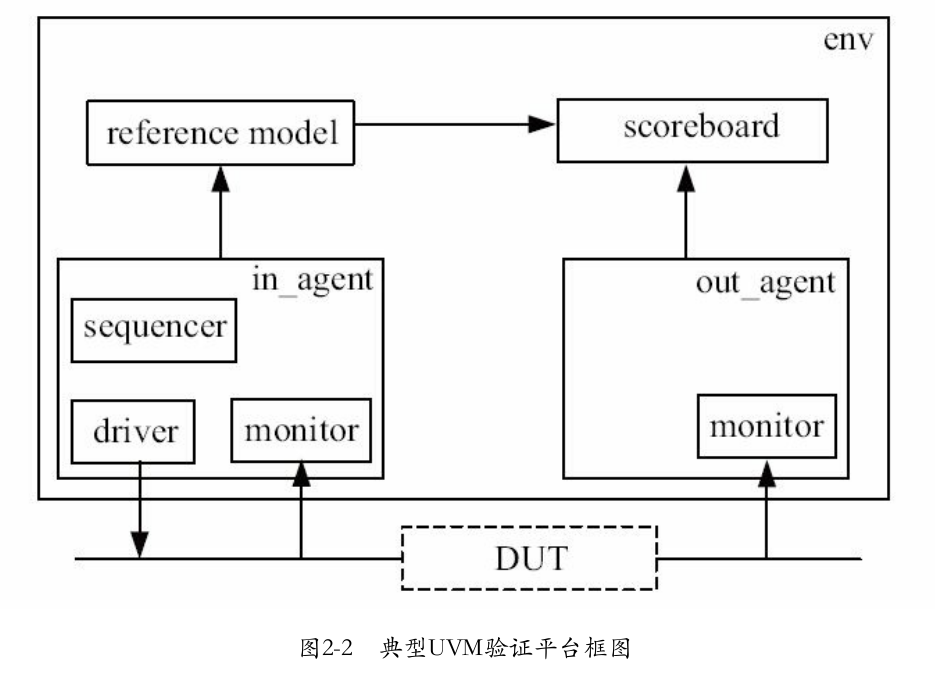

1. systemverilog 中的面向对象中，local位类似C++中的private,local类型不会被类外部使用直接引用的方式进行访问．多态用虚汗数virtual实现，利用rand类型和randomize()函数来对变量进行随机化，以及利用constraint或在调用randomize时对数据进行约束．比如：
```systemverilog
initial begin
    animal aml;
    aml = new();
    assert(aml.randomize() with {data > 10; data < 30;});
end
```
2. 验证平台要模拟DUT的各种真实使用情况，这意味着要给DUT施加各种激励，有正常的激励，也有异常的激励；有这种模式的激励，也有那种模式的激励。激励的功能是由driver来实现的。
3. 证平台要能够根据DUT的输出来判断DUT的行为是否与预期相符合，完成这个功能的是记分板（scoreboard）。
4. 验证平台要收集DUT的输出并把它们传递给scoreboard，完成这个功能的是monitor。
5. 在UVM中，引入了agent和sequence的概念，因此UVM中验证平台的典型框图如下图所示。  
 
6. super.new();用来调用父类的构造函数
7. 有派生自uvm_driver的类的new函数有两个参数，一个是string类型的name，一个是uvm_component类型的parent。
8. driver所做的事情几乎都在main_phase中完成。UVM由phase来管理验证平台的运行，这些phase统一以xxxx_phase来命名，且都有一个类型为uvm_phase、名字为phase的参数。main_phase是uvm_driver中预先定义好的一个任务。因此几乎可以简单地认为，实现一个driver等于实现其main_phase。